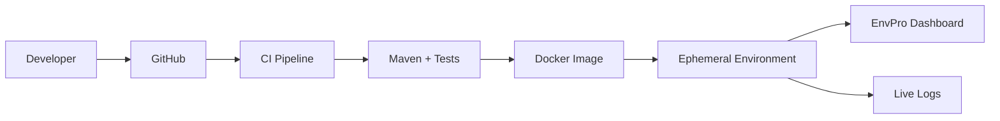
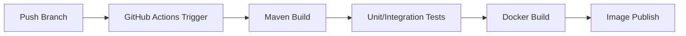
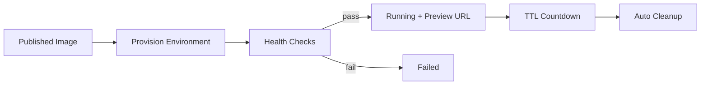
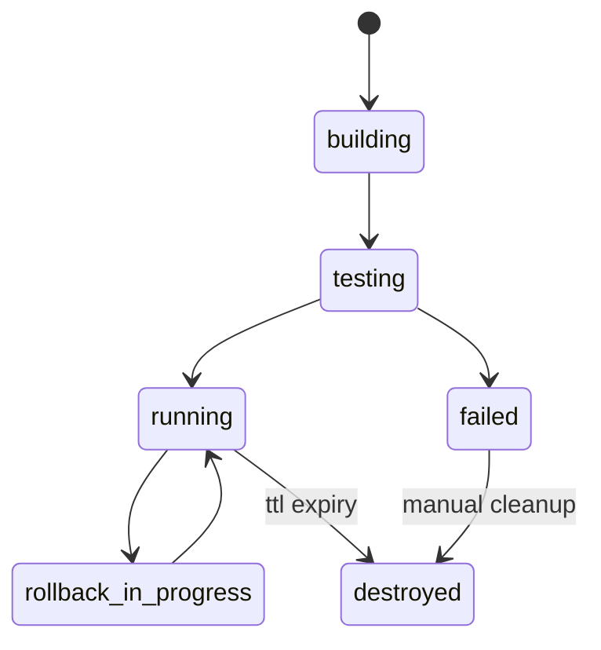
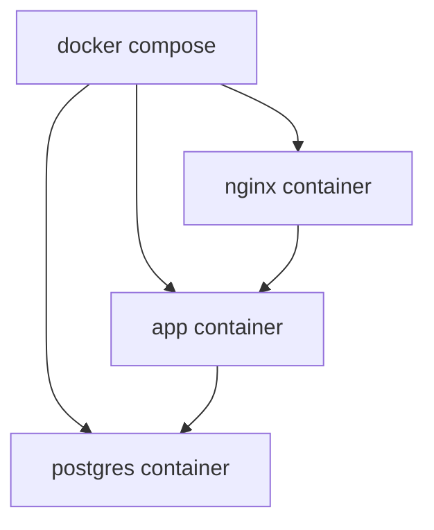
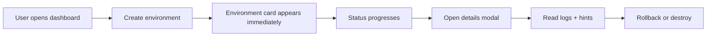
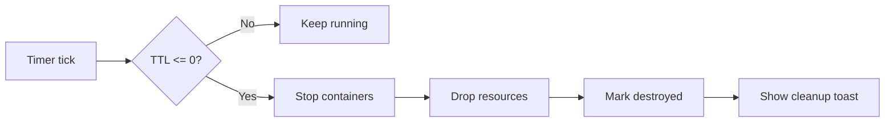

# Architecture Diagrams

## Overall System

```mermaid
flowchart LR
  Dev[Developer] --> GH[GitHub]
  GH --> CI[CI Pipeline]
  CI --> Build[Maven + Tests]
  Build --> Img[Docker Image]
  Img --> Env[Ephemeral Environment]
  Env --> UI[EnvPro Dashboard]
  Env --> Logs[Live Logs]
```

## CI Pipeline

```mermaid
flowchart LR
  Push[Push Branch] --> A[GitHub Actions Trigger]
  A --> B[Maven Build]
  B --> C[Unit/Integration Tests]
  C --> D[Docker Build]
  D --> E[Image Publish]
```

## CD Workflow

```mermaid
flowchart LR
  E[Published Image] --> P[Provision Environment]
  P --> H[Health Checks]
  H -->|pass| R[Running + Preview URL]
  H -->|fail| F[Failed]
  R --> T[TTL Countdown]
  T --> X[Auto Cleanup]
```

## Environment Lifecycle

```mermaid
stateDiagram-v2
  [*] --> building
  building --> testing
  testing --> running
  testing --> failed
  running --> rollback_in_progress
  rollback_in_progress --> running
  running --> destroyed : ttl expiry
  failed --> destroyed : manual cleanup
```

## Docker Interaction

```mermaid
flowchart TB
  Compose[docker compose] --> App[app container]
  Compose --> DB[postgres container]
  Compose --> Proxy[nginx container]
  App --> DB
  Proxy --> App
```

## User Flow

```mermaid
flowchart LR
  U[User opens dashboard] --> C[Create environment]
  C --> Card[Environment card appears immediately]
  Card --> S[Status progresses]
  S --> D[Open details modal]
  D --> L[Read logs + hints]
  L --> R[Rollback or destroy]
```

## Cleanup Workflow

```mermaid
flowchart LR
  Tick[Timer tick] --> Check{TTL <= 0?}
  Check -->|No| Keep[Keep running]
  Check -->|Yes| Stop[Stop containers]
  Stop --> Drop[Drop resources]
  Drop --> Mark[Mark destroyed]
  Mark --> Toast[Show cleanup toast]
```
